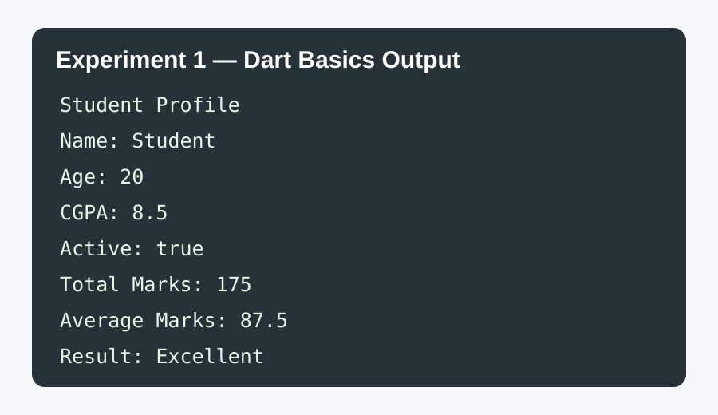
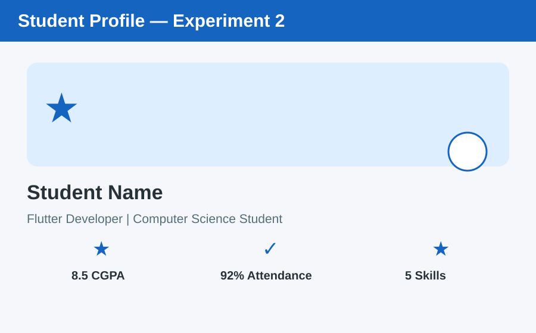
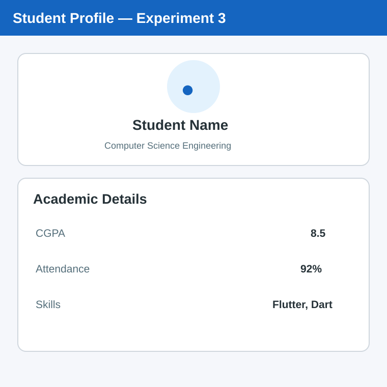
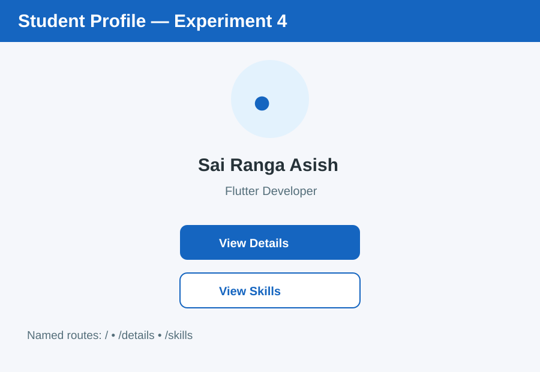
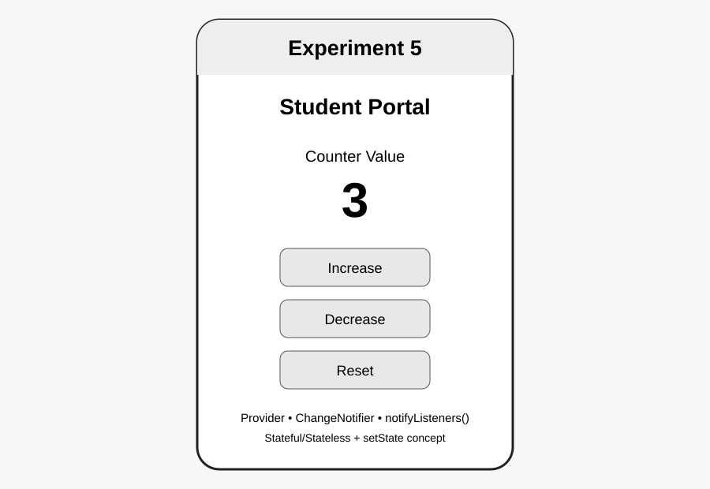

# Student Profile App (Flutter)

## Abstract

The Student Profile App is a cross-platform mobile application developed using **Flutter** to provide an efficient and user-friendly solution for managing student information. The application enables students to create, update, and maintain their personal, academic, and professional profiles in a centralized and secure environment. It includes features such as profile management, academic details, attendance, skills, certifications, achievements, and document uploads.

The app uses Flutter's modern UI framework to deliver a responsive and consistent user experience on both Android and iOS devices from a single codebase. A backend database, such as Firebase or another cloud service, can securely store student data and provide real-time synchronization and authentication. Faculty and administrators can access authorized student information, verify records, and monitor academic progress through role-based access control.

## Experiments 1–5

### Experiment 1 — Dart Basics
Variables, data types, arithmetic operations, string interpolation and conditional statements.

**Output:**



### Experiment 2 — Flutter Widgets and Layouts
Uses Flutter widgets with **Row**, **Column** and **Stack** to build a student profile interface.

**Output:**



### Experiment 3 — Responsive UI
Uses **MediaQuery** and tablet/desktop breakpoints to adapt the profile layout to different screen sizes.

**Output:**



### Experiment 4 — Navigation and Named Routes
Uses **Navigator.pushNamed()**, named route constants and multiple screens for profile navigation.

**Output:**



### Experiment 5 — Stateful & Stateless Widgets + State Management
Demonstrates **StatelessWidget**, **StatefulWidget**, **setState()**, and **Provider** using ChangeNotifier and notifyListeners() for counter state management.

**Output:**



## Experiment Files

```text
experiments/
├── 01_dart_basics.dart
├── 02_widgets_layouts.dart
├── 03_responsive_ui.dart
├── 04_navigation_named_routes.dart
├── 05_setstate_counter.dart
├── 05_state_management.dart
└── counter_provider.dart
```
